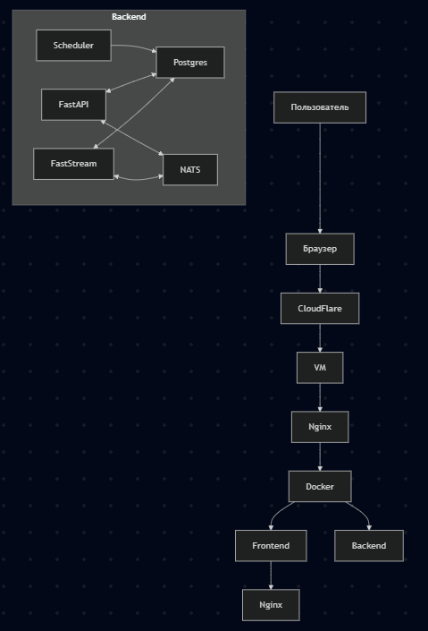

# Бэкенд

## Docker

### Локальный запуск

1. Всё внутри докера:
    ```bash
    docker compose -f docker-compose.local.yml up --build -d
    ```
    ```bash
    docker compose -f docker-compose.local.yml up --build -d api
    ```
2. Запуск из IDE:
    1. Поднять psql и redis:
        ```bash
        docker compose -f docker-compose.local.yml --env-file=.env run --remove-orphans -d -p 5432:5432 database
        docker compose -f docker-compose.local.yml --env-file=.env run --remove-orphans -d -p 6379:6379 redis
        ```
    2. Запускать из `MAX_task_magager/backend`:
        ```bash
        python -m maxhack.bot
        python -m maxhack.web
        python -m maxhack.scheduler
        python -m maxhack.broker
        ```

---

## 🤖 Технологии

### 1. **Python как связующее звено**

**Причина выбора:**
- Python — высокоуровневый, выразительный и легко читаемый язык с богатой экосистемой, особенно в области системной автоматизации, сетевого взаимодействия и интеграции.
- Он идеально подходит для «склейки» разнородных компонентов: запуска внешних утилит (вроде `nmap`), обработки их вывода, взаимодействия с БД, веб-API и очередями сообщений.
- Большое количество готовых библиотек (`python-nmap`, `asyncio`, `aiohttp`, `pydantic` и др.) ускоряет разработку и снижает риски ошибок.

---

### 2. **[PostgreSQL](https://ru.wikipedia.org/wiki/PostgreSQL) как РСУБД для хранения отчётов сканов**

**Причина выбора:**
- PostgreSQL — надёжная, мощная и расширяемая реляционная СУБД с отличной поддержкой ACID, транзакций и сложных запросов.
- Поддержка JSON/JSONB типов позволяет гибко хранить структурированные отчёты `nmap` без жёсткой схемы, сохраняя при этом возможность эффективного индексирования и поиска.
- Отличная интеграция с Python и ORM (в частности, с SQLAlchemy), а также зрелые инструменты репликации и резервного копирования повышают отказоустойчивость системы.

---

### 3. [Redis](https://ru.wikipedia.org/wiki/Redis)

**Редис** - это резидентная система управления базами данных класса NoSQL с открытым исходным кодом. \
Он используется для хранения данных состояний пользователей бота (например, последовательного ввода в диалогах).

**Почему он?**
- Открытый исходный код
- Молниеносная скорость (всё хранится в оперативной памяти)
- Простота использования
- Масштабируемость

---

### 4. **[NATS](https://github.com/nats-io/nats.py) как очередь для обмена сообщениями между веб-сервером и запускателями nmap**

**Причина выбора:**
- NATS — лёгкая, высокопроизводительная система обмена сообщениями с поддержкой публикации/подписки и очередей (через NATS JetStream при необходимости сохранения сообщений).
- Минимальные накладные расходы и низкая задержка делают её идеальной для распределённых задач, где веб-сервер принимает запрос на сканирование и отправляет его воркеру без блокировки.
- Простота настройки и использования особенно важна в средах, где хочется избежать тяжеловесных брокеров вроде RabbitMQ или Kafka.

---

### 5. **[FastAPI](https://github.com/fastapi/fastapi) как веб-сервер**

**Причина выбора:**
- FastAPI — современный, быстрый и асинхронный веб-фреймворк с автоматической генерацией OpenAPI/Swagger-документации и встроенной валидацией через Pydantic.
- Отлично подходит для построения RESTful API для управления сканами (запуск, статус, получение результатов).
- Нативная поддержка `async/await` упрощает интеграцию с асинхронными компонентами (NATS, SQLAlchemy async, etc.), что критично для масштабируемости и отзывчивости.

---

### 6. **SQLAlchemy как ORM**

**Причина выбора:**
- SQLAlchemy — самая зрелая и гибкая ORM для Python, предоставляющая как высокоуровневый (declarative), так и низкоуровневый (Core) доступ к БД.
- Поддержка асинхронного режима (через `asyncio` и `asyncpg`) позволяет эффективно взаимодействовать с PostgreSQL в рамках FastAPI и FastStream.
- Гибкость маппинга и поддержка сложных запросов упрощают работу с отчётами, особенно при необходимости агрегации или фильтрации результатов сканирования.

---

### 7. **Dishka как DI-фреймворк**

**Причина выбора:**
- Dishka — современный, лёгкий и быстрый DI-контейнер для Python с поддержкой асинхронности и вложенных контекстов (scoped dependencies).
- Позволяет явно декларировать зависимости (например, сессии БД, клиенты NATS, конфигурации), делая код тестируемым и модульным.
- Особенно полезен в архитектуре с несколькими компонентами (веб-сервер, воркеры), где одни и те же сервисы должны инстанцироваться по-разному в зависимости от контекста.

---

### 8. **APScheduler как планировщик**

**Причина выбора:**
- APScheduler (Advanced Python Scheduler) — гибкий планировщик задач, поддерживающий cron-подобные расписания, интервальные задания и запуск по времени.
- Позволяет реализовать регулярные автоматические сканы без внешних инструментов вроде cron или Airflow, особенно в рамках единого Python-процесса или кластера.
- Поддержка персистентного хранения заданий (в том числе в PostgreSQL) обеспечивает отказоустойчивость: если сервис перезапустится — задания не потеряются.

---

### Сводка: почему такая архитектура эффективна?

Эта комбинация технологий создаёт **модульную, масштабируемую и поддерживаемую систему**:
- **FastAPI** обеспечивает современный и быстрый API.
- **NATS** даёт асинхронную, распределённую обработку заданий.
- **PostgreSQL + SQLAlchemy** обеспечивают надёжное и гибкое хранение данных.
- **Dishka** делает всю логику тестируемой и чётко структурированной.
- **APScheduler** добавляет гибкость в автоматизацию без усложнения инфраструктуры.
- `black` `isort` `ruff` `mypy` как контроль качества кода

Такой стек идеально подходит для задачи автоматизированного сетевого мониторинга/сканирования с возможностью дальнейшего расширения (поддержка других сканеров, веб-интерфейс, алертинг и т.д.).

---

## 👷 Структура

```
maxhack
│
├───bot - БОТ личной персоной
│   ├───handlers - Обработчики
│   ├───middlewares - Мидлвари
│   └───widgets - Кнопочки и клавиатура
│
├───core - Получение данных из БД, обращения к infra.database
│
├───di - Дишка
│
├───infra - Всё о БД, Алхимия, sql-запросики
│   └───database - БД, контекстные менеджеры и крафт асинхронных сессий
│       ├───models - Моделки
│       └───repos - Репозитории
│
├───logger - Логирование
│   ├───bot - Логи бота
│   └───web - Логи API
│
├───scheduler - Планировщик и т.д
├───utils - всякое)
│
└───web - API и всё что с ним связано
    ├───routes - Запросы в API
    ├───schemas - Схемы веб-API, Валидация payload, очереди
    └───static - Пустая папка и одинокий __init__
migrations - Миграции
```

---

## 🤝 Взаимодействия



---

### Пример .env
Смотрите в .env.example
